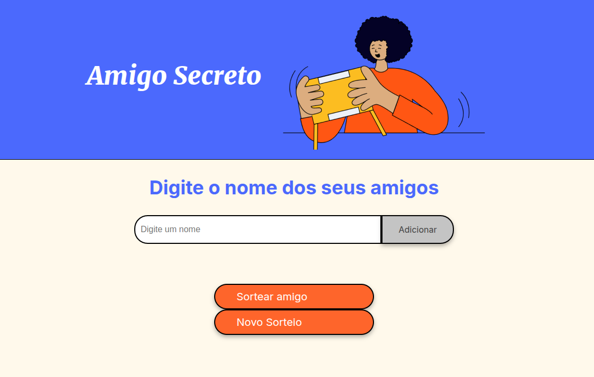

# Amigo Secreto

## Sobre

Este projeto é um desafio do modulo de "Formação Iniciante em Programação" do curso promovido pela Alura em parceria com a ONE (Oracle Next Education).

Nessa aplicação web, os usuários podem adicionar nomes à lista de amigos e sortear um amigo secreto aleatoriamente. A aplicação também permite começar um novo sorteio.

## Funcionalidades

- Adicionar nomes dos amigos a lista
- O nome de um dos amigo sera sorteado aleatoriamente
- Iniciar novo sorteio

### Tecnologias Utilizadas

